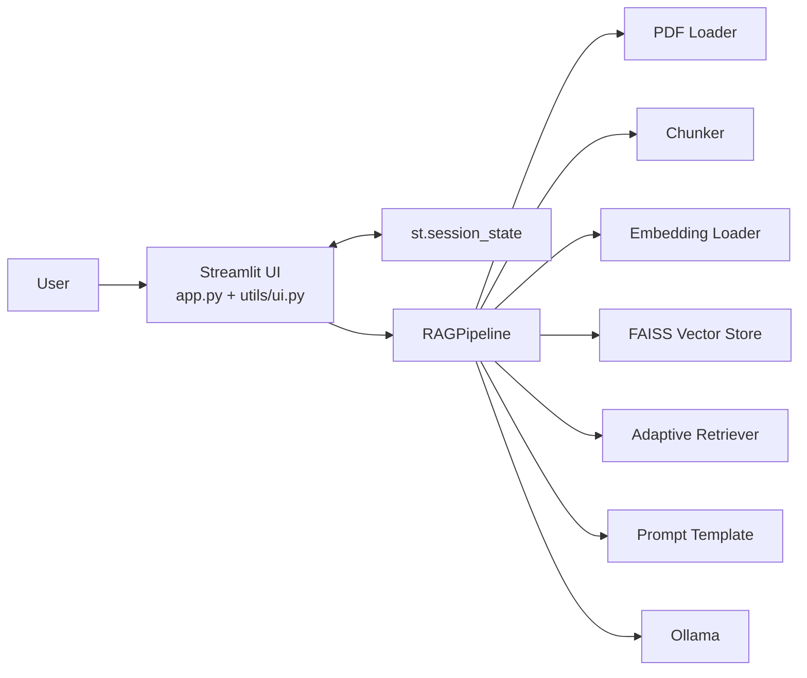
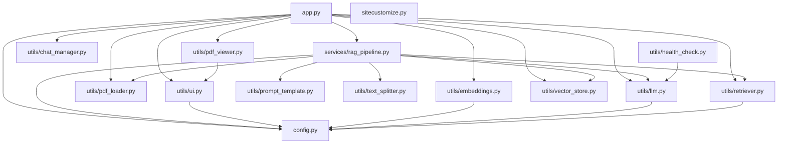

# Architecture

## Scope
This document describes the current `RAG-PDF-Chatbot` codebase exactly as implemented.

## System Overview
The application is a local-only PDF question answering system built around:

- Streamlit for UI, session state, and caching
- `pypdf` for page-level text extraction
- a custom paragraph-aware chunker
- a local sentence-transformer embedding wrapper
- FAISS for dense retrieval
- an adaptive retriever that can combine FAISS MMR and optional BM25
- Ollama for local answer generation

## High-Level Component Diagram


## Layers

### UI Layer
Files:

- [app.py](/C:/Users/saksh/RAG-PDF-Chatbot/app.py)
- [utils/ui.py](/C:/Users/saksh/RAG-PDF-Chatbot/utils/ui.py)
- [utils/pdf_viewer.py](/C:/Users/saksh/RAG-PDF-Chatbot/utils/pdf_viewer.py)
- [utils/chat_manager.py](/C:/Users/saksh/RAG-PDF-Chatbot/utils/chat_manager.py)

Responsibilities:

- builds the upload/chat interface
- manages sidebar actions
- manages visible chat history
- renders the PDF viewer

### Pipeline Layer
File:

- [services/rag_pipeline.py](/C:/Users/saksh/RAG-PDF-Chatbot/services/rag_pipeline.py)

Responsibilities:

- orchestrates extraction, chunking, vector-store creation, retrieval, context building, fallback generation, and final prompting
- caches page extraction, chunk generation, and vector-store construction

### Retrieval Layer
Files:

- [utils/retriever.py](/C:/Users/saksh/RAG-PDF-Chatbot/utils/retriever.py)
- [utils/vector_store.py](/C:/Users/saksh/RAG-PDF-Chatbot/utils/vector_store.py)

Responsibilities:

- question-type detection
- query rewriting
- retrieval-depth planning
- FAISS MMR retrieval
- optional BM25 retrieval
- reciprocal rank fusion
- heuristic reranking

### Model Layer
Files:

- [utils/embeddings.py](/C:/Users/saksh/RAG-PDF-Chatbot/utils/embeddings.py)
- [utils/llm.py](/C:/Users/saksh/RAG-PDF-Chatbot/utils/llm.py)

Responsibilities:

- local embedding model loading from cache
- Ollama validation and model resolution
- prompt submission to local Ollama inference

## Dependency Graph


## Project Structure
```text
RAG-PDF-Chatbot/
|-- app.py
|-- config.py
|-- current_packages.txt
|-- README.md
|-- requirements.txt
|-- sitecustomize.py
|-- services/
|   `-- rag_pipeline.py
|-- tests/
|   |-- test_embeddings.py
|   |-- test_pdf.py
|   `-- test_retrieval.py
|-- uploaded_pdfs/
|-- utils/
|   |-- chat_manager.py
|   |-- embeddings.py
|   |-- health_check.py
|   |-- llm.py
|   |-- pdf_loader.py
|   |-- pdf_viewer.py
|   |-- prompt_template.py
|   |-- retriever.py
|   |-- text_splitter.py
|   |-- ui.py
|   `-- vector_store.py
|-- vectorstore/
`-- docs/
```

## Architectural Notes

### Startup Watcher Workaround
The project intentionally disables Streamlit file watching for Streamlit processes using:

- [.streamlit/config.toml](/C:/Users/saksh/RAG-PDF-Chatbot/.streamlit/config.toml)
- [sitecustomize.py](/C:/Users/saksh/RAG-PDF-Chatbot/sitecustomize.py)

This exists because Streamlit's watcher can interact badly with `torch.classes`.

### Optional BM25
Hybrid retrieval is conditional:

- if `rank-bm25` is installed, BM25 contributes to hybrid retrieval
- if not, retrieval falls back to FAISS-only mode without crashing
