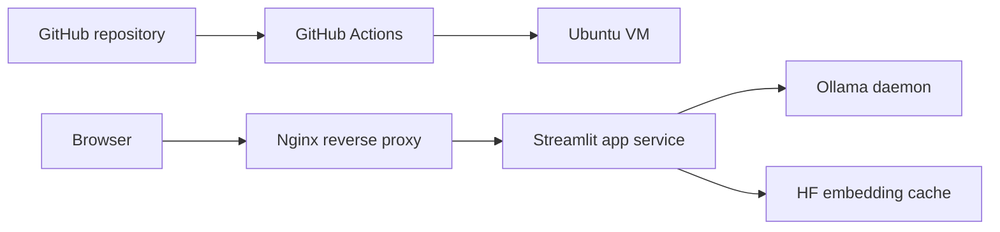

# Self-Hosted Deployment From GitHub To A Linux VM

## Recommendation

For the current codebase, self-hosting on a Linux VM is the best deployment path because the app depends on:

- a local Ollama daemon
- local Ollama models
- a locally cached embedding model

That matches a VM much better than Streamlit Community Cloud.

## Target Architecture



## What This Repo Now Includes

- [deploy/ubuntu-vm/bootstrap.sh](/C:/Users/saksh/RAG-PDF-Chatbot/deploy/ubuntu-vm/bootstrap.sh)
- [deploy/ubuntu-vm/install_service.sh](/C:/Users/saksh/RAG-PDF-Chatbot/deploy/ubuntu-vm/install_service.sh)
- [deploy/ubuntu-vm/update.sh](/C:/Users/saksh/RAG-PDF-Chatbot/deploy/ubuntu-vm/update.sh)
- [deploy/ubuntu-vm/nginx/rag-pdf-chatbot.conf](/C:/Users/saksh/RAG-PDF-Chatbot/deploy/ubuntu-vm/nginx/rag-pdf-chatbot.conf)
- [.github/workflows/deploy-vm.yml](/C:/Users/saksh/RAG-PDF-Chatbot/.github/workflows/deploy-vm.yml)
- [scripts/preload_embeddings.py](/C:/Users/saksh/RAG-PDF-Chatbot/scripts/preload_embeddings.py)

## One-Time VM Setup

Recommended OS:

- Ubuntu 22.04 LTS or Ubuntu 24.04 LTS

Recommended minimum size:

- 2 vCPU
- 4 GB RAM
- 20 GB disk

### 1. Create the VM

Open these ports:

- `80` for web access
- `22` for SSH

### 2. Install the app from GitHub

On the VM:

```bash
git clone https://github.com/s-a-k-s-h-i-03/RAG-PDF-Chatbot.git /opt/rag-pdf-chatbot
cd /opt/rag-pdf-chatbot
chmod +x deploy/ubuntu-vm/*.sh
APP_DIR=/opt/rag-pdf-chatbot ./deploy/ubuntu-vm/bootstrap.sh
```

This setup script:

- installs system packages
- installs Ollama
- starts the Ollama service
- creates a Python virtual environment
- installs Python dependencies
- pulls `tinyllama`
- downloads the embedding model into local cache
- creates a systemd service for Streamlit
- configures Nginx

## GitHub-Based Continuous Deployment

The repository now includes a GitHub Actions workflow that deploys on:

- every push to `main`
- manual workflow runs

### Required GitHub Secrets

Add these repository secrets:

- `DEPLOY_HOST`: your VM public IP or hostname
- `DEPLOY_PORT`: SSH port, usually `22`
- `DEPLOY_USER`: Linux user used for deployment
- `DEPLOY_SSH_KEY`: private SSH key for that user
- `DEPLOY_APP_DIR`: app path on the VM, for example `/opt/rag-pdf-chatbot`

### Server Permission Requirement

The deployment user must be able to restart the app service without an interactive password.

Example sudoers entry:

```bash
deploy ALL=NOPASSWD: /bin/systemctl restart rag-pdf-chatbot, /bin/systemctl status rag-pdf-chatbot
```

## Update Flow

When GitHub Actions runs:

1. GitHub connects to the VM over SSH.
2. The VM runs [deploy/ubuntu-vm/update.sh](/C:/Users/saksh/RAG-PDF-Chatbot/deploy/ubuntu-vm/update.sh).
3. The script:
   - pulls the latest code
   - refreshes Python dependencies
   - refreshes the embedding cache
   - ensures the Ollama model is present
   - restarts the Streamlit service

## Service Commands

```bash
sudo systemctl status rag-pdf-chatbot
sudo systemctl restart rag-pdf-chatbot
sudo journalctl -u rag-pdf-chatbot -n 200 --no-pager
sudo systemctl status ollama
```

## Notes Specific To This App

- The app currently defaults to the `tinyllama` Ollama model.
- The embedding cache is stored under `HF_HOME`, which the service sets to `${APP_DIR}/.hf-cache`.
- This keeps deployment self-contained and avoids relying on a specific Linux home directory cache layout.

## Recommended Next Step

If you want HTTPS and a custom domain, add:

- DNS pointing to the VM
- a TLS certificate with Let's Encrypt
- a domain-specific Nginx server name
