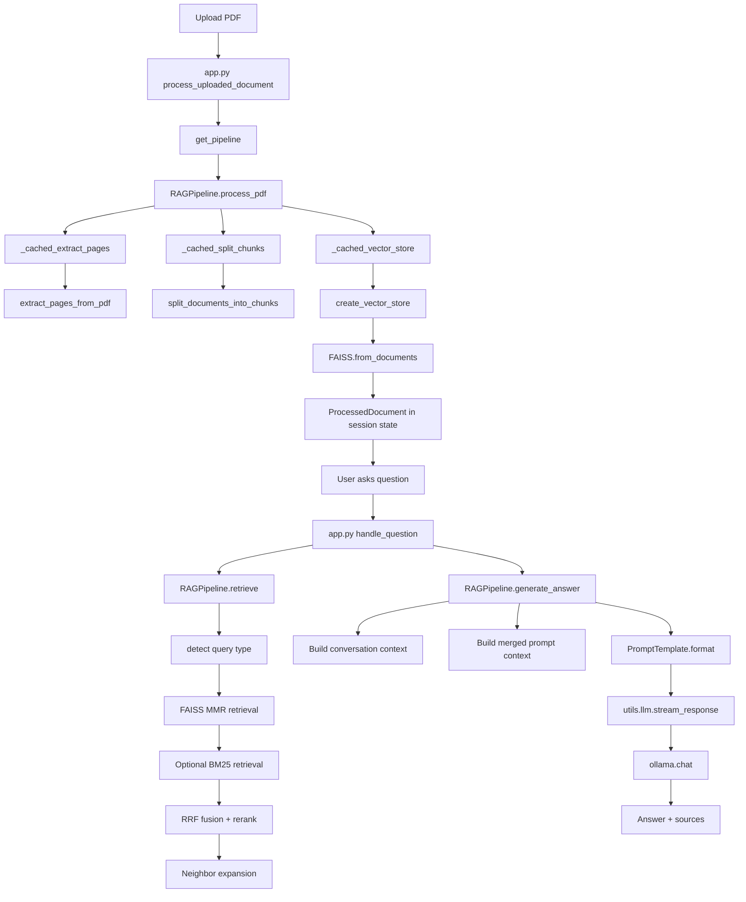
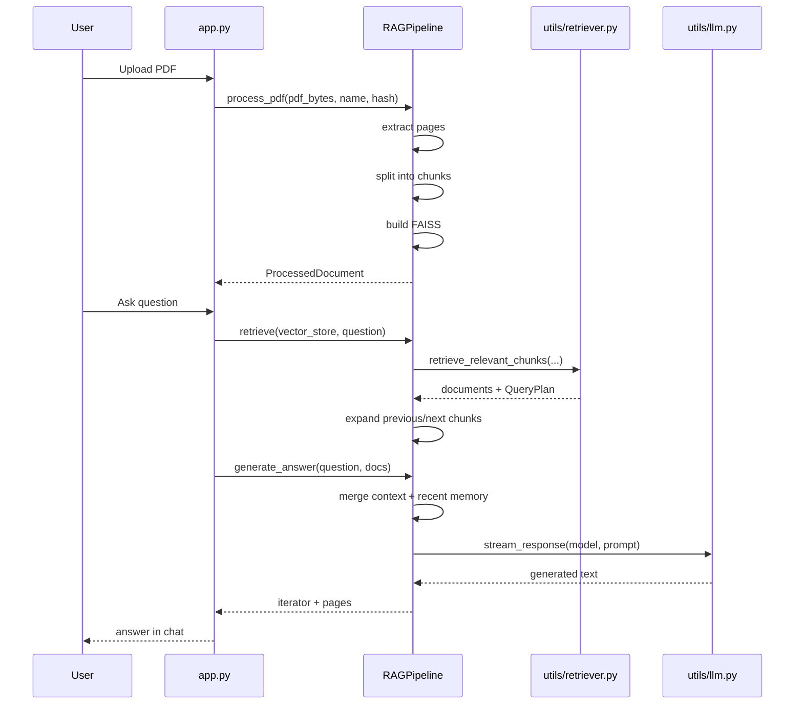

# Workflow

## End-to-End Data Flow

## Request Lifecycle

## PDF Processing Flow

1. `render_sidebar()` stores the uploaded file in `st.session_state["sidebar_uploaded_file"]`.
2. `process_uploaded_document()` hashes bytes with SHA-256.
3. `RAGPipeline.process_pdf()` calls:
   - `_cached_extract_pages()`
   - `_cached_split_chunks()`
   - `_cached_vector_store()`
4. The result is stored as `st.session_state.processed_document`.

## Question Handling Flow

1. `handle_question()` appends the user message to session state.
2. `RAGPipeline.retrieve()` gets all FAISS docstore documents.
3. `utils.retriever.detect_query_plan()` classifies the question.
4. `utils.retriever.retrieve_relevant_chunks()` runs:
   - FAISS MMR retrieval
   - optional BM25 retrieval
   - reciprocal rank fusion
   - question-type-aware reranking
5. `RAGPipeline._expand_with_neighbors()` adds adjacent chunks.
6. `RAGPipeline.build_context()` deduplicates and merges context.
7. `RAGPipeline.generate_answer()`:
   - gathers recent conversation
   - formats the prompt
   - calls Ollama
   - falls back to a non-LLM answer when needed

## Current RAG Techniques

| Stage | Technique used now |
|---|---|
| Parsing | page-wise text extraction with `pypdf` |
| Chunking | paragraph-aware custom chunking with heading/list/table heuristics |
| Embeddings | local `SentenceTransformer` wrapper |
| Dense retrieval | FAISS MMR |
| Sparse retrieval | optional BM25 |
| Fusion | reciprocal rank fusion |
| Adaptive retrieval | query-type planning + internal query rewrite |
| Context expansion | previous/current/next chunk inclusion |
| Context cleaning | deduplication + adjacent merge |
| Memory | last 5 exchanges as plain text |
| LLM call | blocking local Ollama request |

## Important Exact Behaviors

- Ollama response "streaming" is simulated by splitting the fully completed answer into whitespace chunks.
- `generate_answer()` may append a `Source:` line, and `app.py` also appends source formatting, so duplicate citations can occur.
- BM25 is optional at runtime even though it is listed in `requirements.txt`.

